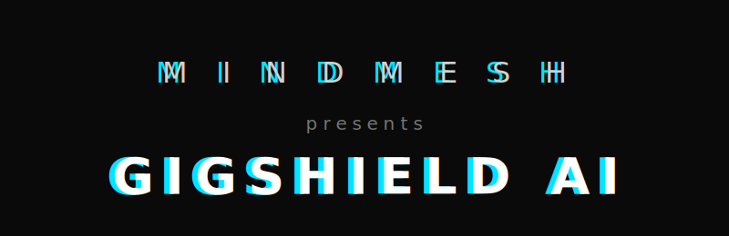
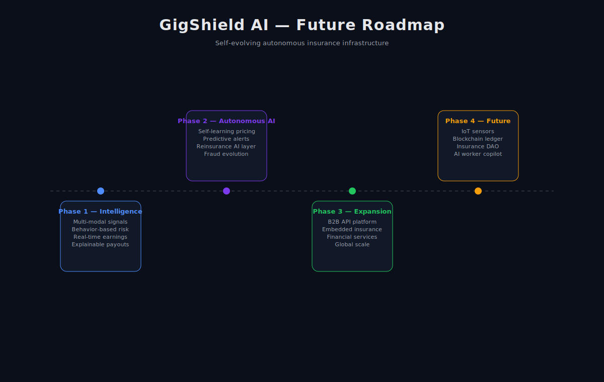

  
  <br />

</div>


<br/>

<div align="center">


</div>


<br/>

<br/>

<div align="center">
  <a href="https://v0-gig-shield-ai-website-c9k1.vercel.app/" target="_blank">
    
  </a>
</div>

<br/>

<br/>


> **When it rains in Bengaluru, Raju should sleep peacefully**  
> **knowing that by morning, his earnings are protected**

<br/>

---

</div>

<br/>

## ⚡ The Problem — In Plain Numbers

<div align="center">

| Metric | Reality |
|--------|---------|
| 🇮🇳 Gig workers in India (2024) | **~450 Million** |
| 🔴 Workers with income protection | **< 3%** |
| 💸 Average loss per disruption event | **₹3,500 – ₹7,000** |
| 📅 Disruption days per worker per year | **18 – 26 days** |
| 🏚️ Annual unprotected income loss | **~₹1.2 Lakh Crore** |
| 📈 Gig economy's share of Indian GDP | **4.5% (growing 15% YoY)** |

</div>

India's 450M platform delivery workers — Zomato riders, Swiggy partners, Zepto delivery agents — are the invisible backbone of our digital economy. Yet when a cyclone hits Chennai, a bandh shuts down Bengaluru, or AQI crosses 400 in Delhi, they earn **₹0**. Rent is still due. School fees are still due. There is **no safety net**.

GigShield AI exists to change that.

<br/>

---

## 🛡️ Our Solution — What is GigShield AI?

> **GigShield AI is a fully-automated, AI-powered parametric insurance platform.**  
> No paperwork. No calls. No waiting 45 days. **If it rains above threshold → you get paid. Automatically. In under 15 minutes.**

### What is Parametric Insurance?

```
❌ Traditional Insurance:
   "Prove your loss → we verify → we decide → maybe we pay → in 45 days"

✅ Parametric Insurance:
   "If rainfall > 115mm in your city today → we pay ₹Y automatically. Period."
```

The **parameter** triggers the payout — not subjective damage assessment. Perfect for gig workers because income loss is directly correlated to measurable, verifiable external events.

<br/>

---

## 🎯 Persona — Who We Protect

**Target Segment: Food & Q-Commerce Delivery Partners**

```
Meet Raju Kumar
━━━━━━━━━━━━━━━━━━━━━━━━━━━━━━━━━━━━━━━
  Age        │ 27 years old
  City       │ Bengaluru (Indiranagar Zone)
  Platform   │ Swiggy delivery partner (3 years)
  Earnings   │ ₹4,800 – ₹5,500 / week
  Device     │ Redmi Note 12, Airtel 4G
  Fear       │ "What happens when heavy rains stop all orders?"
━━━━━━━━━━━━━━━━━━━━━━━━━━━━━━━━━━━━━━━
```

**Platforms Served:** Zomato · Swiggy · Zepto · Blinkit · Amazon · Dunzo · Porter

<br/>

---

## 🌩️ Disruption Coverage Matrix

> **CRITICAL:** GigShield covers **INCOME LOSS ONLY**.  
> ❌ No health claims &nbsp;|&nbsp; ❌ No accident medical bills &nbsp;|&nbsp; ❌ No vehicle repairs

| Category | Disruption | Trigger Threshold | Income Impact |
|----------|-----------|------------------|---------------|
| 🌡️ Environmental | Extreme Heat | Temp > 44°C OR AQI > 300 | 60–80% drop |
| 🌧️ Environmental | Heavy Rain / Flood | Rainfall > 115 mm/day | 80–100% drop |
| 🌫️ Environmental | Dense Fog | Visibility < 50 m | 70% drop |
| 🌀 Environmental | Cyclone / Storm | Wind speed > 60 kmph | 90–100% drop |
| 🚫 Social / Civic | Bandh / Strike | Govt or Local Bandh declared | 100% drop |
| 🔒 Social / Civic | Curfew / Section 144 | Govt notification issued | 100% drop |
| 🏪 Social / Civic | Market Zone Closure | Zonal shutdown order | 50–70% drop |
| 💨 Pollution | Severe Air Pollution | AQI > 400 (Hazardous) | 40–60% drop |

<br/>

---

## 💎 Weekly Plans — Aligned to Gig Earnings Cycle

> All plans are priced **per week**, matching how gig workers think about money.


## 🛡️ GigShield Plans

<table align="center">
  <tr>
    <td align="center">
      <h3>🔵 SHIELD BASIC</h3>
      <b>₹49 / week</b><br><br>
      Covers ₹800/wk<br>
      Heavy Rain only
    </td>
    <td align="center">
      <h3>🟡 SHIELD PLUS</h3>
      <b>₹89 / week</b><br><br>
      Covers ₹1,800/wk<br>
      Rain + AQI + Bandh<br>
      ⭐ AI Recommended
    </td>
    <td align="center">
      <h3>🔴 SHIELD MAX</h3>
      <b>₹149 / week</b><br><br>
      Covers ₹3,500/wk<br>
      All triggers<br>
      ⚡ Priority Support
    </td>
  </tr>
</table>


**Dynamic Pricing:** Every Monday, the AI re-prices your premium based on a 14-day disruption forecast for your specific zone.

<br/>

---

## 🤖 How Raju's Journey Works — End-to-End Flow

```
STEP 1: DISCOVERY
  └─► Raju sees Swiggy in-app banner → "Protect earnings from rains & bandhs — ₹49/week"

STEP 2: ONBOARDING (< 3 minutes)
  └─► Login via Swiggy Partner ID (OAuth)
      AI auto-pulls delivery zones + 12-week earnings history
      3-question voice onboarding in Kannada ✓

STEP 3: AI RISK PROFILING (background, ~8 seconds)
  └─► 14-day weather forecast for Bengaluru
      Historical disruption frequency for Raju's delivery zones
      Income Stability Score (0–100): Raju scores 68/100 (Medium-High)
      Flags: "3 potential disruption windows in next 7 days"

STEP 4: PLAN SELECTION
  └─► AI recommends Shield Plus (₹89/week)
      Raju pays via UPI in one tap → Policy LIVE in 30 seconds

STEP 5: DISRUPTION HITS (Thursday, 11:47 PM)
  └─► Bengaluru receives 148mm rain in 6 hours
      Swiggy order volumes drop 94% in Raju's zone
      GigShield Disruption Engine detects threshold breach
      Cross-validates: IMD API + Dark Sky API + IoT sensors → Confidence: 97.4%
      Fraud check (8 seconds): GPS = home ✓, Swiggy = 0 orders ✓
      → CLAIM AUTO-APPROVED. Raju is asleep. ✓

STEP 6: RAJU WAKES UP TO MONEY
  └─► 6:13 AM → WhatsApp message:
      "Namaskar Raju! Heavy rain detected in your zone. ₹892 credited to raju@okaxis ✓"
      No form. No call. No waiting. Just money.
```

<br/>

---

## 🧠 System Architecture

```
┌─────────────────────────────────────────────────────────────────────────────┐
│                          GIGSHIELD AI ARCHITECTURE                          │
├─────────────────────────────────────────────────────────────────────────────┤
│                                                                             │
│  ┌──────────────┐   ┌──────────────┐   ┌──────────────┐   ┌──────────────┐  │
│  │  DATA LAYER  │   │   AI LAYER   │   │ BUSINESS CORE│   │    CLIENT    │  │
│  ├──────────────┤   ├──────────────┤   ├──────────────┤   ├──────────────┤  │
│  │ IMD Weather  │   │ Risk Profiler│   │ Policy Engine│   │ Web App      │  │
│  │ AQI / CPCB   │──►│ Premium Price│──►│ Claims Proc. │──►│ WhatsApp Bot │  │
│  │ Civic Alerts │   │ Fraud Detect │   │ Payout Calc. │   │ Admin Dash   │  │
│  │ Platform APIs│   │ NLP Onboard  │   │ Param.Trigger│   │              │  │
│  │ GPS Streams  │   │ Churn Predict│   │ Disrupt. Eng.│   │              │  │
│  └──────────────┘   └──────────────┘   └──────────────┘   └──────────────┘  │
│         │                  │                  │                  │          │
│         ▼                  ▼                  ▼                  ▼          │
│  ┌──────────────┐   ┌──────────────┐   ┌──────────────┐   ┌──────────────┐  │
│  │ Apache Kafka │   │ PostgreSQL   │   │ Redis Cache  │   │ Razorpay     │  │
│  │ AWS Kinesis  │   │ MongoDB      │   │              │   │ UPI / IMPS   │  │
│  │ Socket.IO    │   │ Apache Spark │   │              │   │ Wallet       │  │
│  └──────────────┘   └──────────────┘   └──────────────┘   └──────────────┘  │
│                                                                             │
└─────────────────────────────────────────────────────────────────────────────┘
```

<br/>

---

## 🤖 The Five AI Agents

| Agent | Role | Key Actions |
|-------|------|------------|
| 🧩 **Onboarding Agent** | Worker identity + risk profile | OAuth verify, earnings pull, voice NLP, plan recommendation |
| 🛰️ **Disruption Sentinel** | 24/7 real-time monitoring | Polls 15+ APIs every 5 min, declares disruption at >90% confidence |
| 🔍 **Fraud Investigator** | Claim fraud scoring | GPS trace, order log cross-check, peer validation, GNN ring detection |
| 💸 **Payout Orchestrator** | Payment dispatch | Parametric formula calc, Razorpay UPI call, WhatsApp confirmation |
| 📊 **Analytics & Pricing Agent** | Model evolution | Re-trains weekly, adjusts premiums per zone, generates insurer reports |

### Automated Claim Pipeline

```
Every 5 min: Sentinel queries 15 APIs → normalises → writes to Kafka
     ↓
Flink evaluates: IF rainfall > 115mm AND zone IN worker_active_zones
     ↓
Policy Engine: finds all active policies in affected zone → creates ClaimDraft
     ↓
Fraud Agent: GPS + platform orders + peer activity → Fraud Score
     ↓ (if score < 30: auto-approve)
Payout = Base Coverage × Severity Multiplier × Hours Affected
     ↓
Razorpay UPI Transfer → WhatsApp + Push notification
     ↓
Immutable audit log written → Analytics agent re-trains models
```

<br/>

---

## 🧬 AI / ML Model Stack

| Model | Purpose | Algorithm |
|-------|---------|-----------|
| **Risk Profiler** | Weekly disruption risk score (0–100) | XGBoost + Random Forest Ensemble |
| **Premium Pricer** | Fair dynamic weekly pricing | GLM + Gradient Boosting (actuarial) |
| **Disruption Classifier** | Classify event type & severity | Multi-label CNN on time-series |
| **Fraud Detector** | Claim fraud probability score | Isolation Forest + Graph Neural Network |
| **NLP Onboarding** | Voice/text in 8 Indian languages | Google Gemini API + Whisper ASR |
| **Earnings Forecaster** | Predict next week's expected income | LSTM / Temporal Fusion Transformer |
| **Churn Predictor** | Flag workers likely to lapse renewal | Logistic Regression + LightGBM |

### Training Datasets

| Dataset | Source | Purpose |
|---------|--------|---------|
| IMD Historical Rainfall (1990–2024) | data.gov.in | Disruption threshold calibration |
| CPCB AQI Historical Data | cpcb.nic.in | Pollution trigger training |
| OpenWeatherMap Historical API | openweathermap.org | Real-time + forecast features |
| PLFS Labour Force Survey | mospi.gov.in | Gig worker income benchmarks |
| NDMA Disaster Event Log | ndma.gov.in | Civic/natural disruption labeling |
| Synthetic Worker Data | Internal | Model training + augmentation |

<br/>

---

## 🔐 Fraud Intelligence Engine

> Industry-first multi-layer fraud detection designed specifically for gig economy claim patterns.

```
LAYER 1 — GPS Validation
  └─► Worker GPS cross-checked against disruption zone boundary polygon

LAYER 2 — Platform Order Cross-Check
  └─► Real order count from Swiggy/Zomato API confirms zero-income claim

LAYER 3 — Peer Income Validation  ← UNIQUE INNOVATION
  └─► Claim validated against anonymised earnings of 200+ peers in same zone, same hour
      Makes individual fraud statistically impossible to fabricate

LAYER 4 — Temporal Anomaly Detection
  └─► Unusual claim patterns / filing times flagged via Isolation Forest

LAYER 5 — Graph Neural Network (GNN) — Organised Fraud Rings
  └─► Detects coordinated fraud across worker social networks

LAYER 6 — Device Fingerprinting
  └─► Detects SIM/device sharing patterns common in organised fraud

LAYER 7 — Duplicate Prevention
  └─► Blockchain-hashed event IDs — zero double-dipping possible

Target Precision: 97%+ | False Positive Rate: < 5%
```

<br/>

---

## 💰 Business Model

### Weighted Average Premium Calculation

```
Plan Mix:  Basic (25%) · Plus (55%) · Max (20%)

Avg Premium = (49 × 0.25) + (89 × 0.55) + (149 × 0.20)
            =  12.25      +  48.95      +   29.80
            = ₹91.00 / worker / week
```

### Weekly Plan Structure

| Plan | Weekly Premium | Annual Equiv. | Coverage | Triggers | Mix |
|------|---------------|--------------|----------|----------|-----|
| 🔵 Shield Basic | ₹49 | ₹2,548/yr | ₹800/wk | Rain only | 25% |
| 🟡 Shield Plus ⭐ | ₹89 | ₹4,628/yr | ₹1,800/wk | Rain + AQI + Bandh | 55% |
| 🔴 Shield Max | ₹149 | ₹7,748/yr | ₹3,500/wk | All 8 triggers | 20% |

> **Why weekly pricing?** ₹89/week feels affordable. ₹4,628/year feels impossible. Same money — completely different psychology. Aligned to how gig workers earn and think.

---

### Unit Economics — Per Worker Per Week

```
REVENUE
━━━━━━━━━━━━━━━━━━━━━━━━━━━━━━━━━━━━━━━━━━━━━━━━
  Gross Premium (weighted avg)         ₹91.00   100.0%
  Less: Reinsurance ceded (14%)       -₹12.74    14.0%
                                      ────────
  Net Earned Premium                   ₹78.26    86.0%
  Add: B2B platform fee (₹8 × 30%)    +₹2.40     2.6%
                                      ────────
  TOTAL REVENUE / WORKER               ₹80.66    88.6%

VARIABLE COSTS
━━━━━━━━━━━━━━━━━━━━━━━━━━━━━━━━━━━━━━━━━━━━━━━━
  Claims payout (60% loss ratio)      -₹46.96    51.6%
  Payout processing fee (Razorpay)     -₹2.75     3.0%
  Tech & Cloud (8% of GP)              -₹7.28     8.0%
  Ops & Compliance (6% of GP)          -₹5.46     6.0%
  ML Infrastructure (3% of GP)         -₹2.73     3.0%
                                      ────────
  TOTAL VARIABLE COST                  ₹65.18    71.6%
                                      ════════
  CONTRIBUTION MARGIN / WORKER         ₹15.48    17.0%
```

> Each additional worker generates **₹15.48/week** toward covering fixed costs. This is the engine of the model.

---

### Payout Formula

```
Payout = Base Coverage × Severity Multiplier × Hours Affected
         (capped at weekly plan limit)

Real example — Raju, Shield Plus, 148mm rain (6 hrs):
  = ₹1,800 × 0.85 (high severity) × 0.55 (6hr active window)
  = ₹840 base + confidence adjustment
  = ₹892 credited to raju@okaxis at 6:13 AM ✅
```

---

### Revenue Streams

| # | Stream | Who Pays | How | Margin |
|---|--------|----------|-----|--------|
| 1 | **Premium Collection** | Workers (B2C) | ₹49–149/week | 86% net retention |
| 2 | **Platform Partnership** | Swiggy / Zomato (B2B) | ₹8/worker/week welfare bundle | ~100% |
| 3 | **Reinsurance Commission** | Munich Re / Swiss Re | 22% of ceded premium returned | Pure income |
| 4 | **Risk Intelligence SaaS** | Platforms + Municipalities (B2B2B) | ₹15/worker-equiv/month | 90%+ |
| 5 | **Financial Upsell** | NBFC partners | ₹200–500/micro-loan referral | 100% |

> Streams 4 & 5 launch Year 2 — not needed for profitability, pure upside.

---

### Fixed Cost Structure

| Component | Weekly | Annual |
|-----------|--------|--------|
| Founding team (4 people) | ₹60,000 | ₹31.2 Lakh |
| AWS + APIs + Tooling | ₹15,000 | ₹7.8 Lakh |
| **Total Fixed Weekly** | **₹75,000** | **₹39 Lakh** |

### Customer Acquisition Cost (CAC)

| Phase | Weeks | CAC/Worker | Channel |
|-------|-------|-----------|---------|
| Direct | 1–4 | ₹250 | Paid social, Swiggy banners |
| B2B kickoff | 5–12 | ₹80 | Platform in-app referral |
| Organic | 13+ | ₹30 | Word of mouth, worker networks |

> CAC drops **88%** from Week 1 to Week 13 once B2B deals activate. This is the single biggest lever in the entire model.

---

### Breakeven Calculation

```
Step 1 — Workers needed to cover fixed costs:

  BEP Workers = Fixed Cost ÷ Contribution Margin
              = ₹75,000 ÷ ₹15.48
              = 4,844 workers

Step 2 — When do we hit 4,844 workers?

  Week 15 → 5,500 workers (above threshold, but CAC still high)
  Week 16 → 7,000 workers (1,500 new × ₹80 = ₹1,20,000 CAC spike → still -₹11,612)
  Week 17 → 9,000 workers (margin ₹1,39,320 > fixed+CAC ₹1,35,000 → +₹20,016) ✅
```

**Week 16 vs Week 17 — The Exact Crossover**

| Line Item | Week 16 | Week 17 | Δ |
|-----------|---------|---------|---|
| Active workers | 7,000 | 9,000 | +2,000 |
| Gross premium | ₹6,37,000 | ₹8,19,000 | +₹1,82,000 |
| Less: Reinsurance (14%) | -₹89,180 | -₹1,14,660 | |
| Net earned premium | ₹5,47,820 | ₹7,04,340 | +₹1,56,520 |
| Add: B2B revenue | ₹16,800 | ₹21,600 | +₹4,800 |
| **Total Revenue** | **₹5,64,620** | **₹7,25,940** | **+₹1,61,320** |
| Claims (60%) | -₹3,28,692 | -₹4,22,604 | |
| Payout fees | -₹19,250 | -₹24,750 | |
| Tech + Ops + ML (17%) | -₹1,08,290 | -₹1,39,230 | |
| Fixed costs | -₹75,000 | -₹75,000 | unchanged |
| CAC | -₹40,800 | -₹1,60,000 | +₹1,19,200 |
| **Total Cost** | **₹5,72,032** | **₹7,05,924** | |
| **NET PROFIT / LOSS** | **-₹11,612 ❌** | **+₹20,016 ✅** | **CROSSOVER** |

---

### 📈 Week-by-Week P&L — Key Milestones

| Week | Workers | Weekly P&L (₹) | Cumulative P&L (₹) | Milestone |
|:----:|--------:|---------------:|-------------------:|-----------|
| 1 | 50 | -86,846 | -86,846 | 🚀 Launch |
| 4 | 180 | -87,645 | -3,39,374 | |
| 8 | 700 | -80,241 | -6,73,815 | |
| 9 | 950 | -76,515 | -7,50,330 | 🤝 B2B pilot |
| 12 | 2,400 | -85,838 | -9,78,168 | 📉 Peak deficit |
| 16 | 7,000 | -11,612 | -11,09,880 | Almost there |
| **17** | **9,000** | **+20,016** | **-10,89,864** | ✅ **OPER. BREAKEVEN** |
| 20 | 18,000 | +98,712 | -8,69,130 | |
| 24 | 40,000 | +3,34,360 | +72,230 | |
| **25** | **48,000** | **+3,71,840** | **+4,44,070** | ✅ **CUMULATIVE BREAKEVEN** |
| 30 | 1,18,000 | +12,12,112 | +45,36,182 | |
| 36 | 2,75,000 | +31,93,100 | +1,81,21,282 | |
| 52 | 12,48,000 | +1,67,29,032 | +16,72,22,650 | 🏁 Year 1 end |

---

### Year 1 Financial Summary

```
┌──────────────────────────────────────────────────────┐
│             GIGSHIELD — YEAR 1 FINANCIALS            │
├──────────────────────────┬───────────────────────────┤
│ Week 52 active workers   │          12,48,000        │
│ Total gross premium      │          ₹108.9 Cr        │
│ Total revenue            │          ₹108.7 Cr        │
│ Total claims paid out    │           ₹56.5 Cr        │
│ Total CAC spend          │            ₹3.8 Cr        │
│ Total fixed costs        │            ₹3.9 Cr        │
│ Total operating cost     │           ₹92.0 Cr        │
├──────────────────────────┼───────────────────────────┤
│ NET PROFIT — YEAR 1      │           ₹16.7 Cr        │
│ Net margin               │             15.4%         │
├──────────────────────────┼───────────────────────────┤
│ Operational breakeven    │           Week 17         │
│ Cumulative breakeven     │           Week 25         │
│ Peak deficit             │        ₹11,09,880         │
│ Min. seed required       │    ₹1.5 Cr (30% buffer)   │
│ ROI on seed by Week 52   │           1,113%          │
└──────────────────────────┴───────────────────────────┘
```

### 3-Year Growth Trajectory

| Metric | Year 1 | Year 2 | Year 3 |
|--------|-------:|-------:|-------:|
| Active workers | 12,48,000 | 50,00,000 | 3,00,00,000 |
| Avg weekly premium | ₹91 | ₹95 | ₹102 |
| Gross premium (₹ Cr) | 108.9 | 247 | 1,590 |
| Loss ratio | 60% | 58% | 55% |
| B2B platforms live | 2 | 8 | 25 |
| Net margin | 15.4% | ~22% | ~28% |
| EBITDA (₹ Cr) | 16.7 | 54.3 | 445 |

### Sensitivity — What Breaks the Model?

| Variable | Base | Bear | Bull | BE Week Shift |
|----------|------|------|------|---------------|
| Loss ratio | 60% | 75% | 50% | +4 weeks |
| Avg premium | ₹91 | ₹70 | ₹105 | +4 weeks |
| CAC post-B2B | ₹80 | ₹150 | ₹40 | +5 weeks |
| Worker growth | Base | 50% slower | 25% faster | +6 weeks |
| Fixed costs | ₹75k/wk | ₹1L/wk | ₹60k/wk | +2 weeks |

> **Worst case** (all bear simultaneously): breakeven shifts to Week 26–28, capital need rises to ~₹2 Cr. Still fundable with a standard seed round. The model survives because contribution margin is positive from Day 1 — it is purely a volume game.

---

### Why This Model Wins

| Traditional Insurance | GigShield AI |
|-----------------------|-------------|
| Annual ₹4,628 premium | Weekly ₹89 (same money, affordable framing) |
| 30–90 day claims | Sub-15 min automated payout |
| CAC ₹500–2,000 | CAC ₹30–80 via platform distribution |
| City-level risk | 500m hyper-local zone detection |
| Generic population | Built exclusively for gig workers |
| Static annual pricing | Dynamic weekly repricing every Monday |


## 🏗️ Technology Stack

<div align="center">

### Backend & AI

<p>


</p>

### Frontend

<p>


</p>

### Data & Infrastructure

<p>


</p>

### Integrations & Payments

<p>


</p>

</div>

<br/>

---


### Data & Infrastructure

```
Primary DB    PostgreSQL (Supabase) — ACID, row-level security
Document DB   MongoDB Atlas — claim metadata, sensor payloads
Cache         Redis + Upstash — sub-ms policy state lookup during claims
Cloud         AWS (EKS + Lambda + S3 + SageMaker)
Monitoring    Grafana + Prometheus + Sentry
CI/CD         GitHub Actions + Docker + ArgoCD
Security      Auth0 + AWS KMS + AES-256 + OAuth2 / JWT
```

### Integrations & Payments

```
Weather       IMD API + OpenWeatherMap + Tomorrow.io + AQICN (multi-source redundancy)
Payments      Razorpay Payout API — UPI / IMPS / Wallet (sandbox for demo)
Notifications Twilio WhatsApp API + Firebase FCM + AWS SNS
Maps          Google Maps Platform + HERE Maps
Platform APIs Swiggy Partner API · Zomato Fleet API (OAuth, simulated)
```

<br/>

---

## 📅 6-Week Hackathon Roadmap

```
WEEK 1–2 │ Phase 1: Ideation & Foundation              [Mar 4–20]  ← YOU ARE HERE
━━━━━━━━━┿━━━━━━━━━━━━━━━━━━━━━━━━━━━━━━━━━━━━━━━━━━━━━━━━━━━━━━━━━━━━━━━━━━━━━━
         │ ✅ Problem research & persona definition
         │ ✅ Architecture design & tech stack decision
         │ ✅ Weekly premium model design
         │ ✅ Parametric trigger framework
         │ ✅ AI/ML pipeline planning
         │ ✅ Readme + 2-min video
─────────┼──────────────────────────────────────────────────────────────────────
WEEK 3–4 │ Phase 2: Automation & Protection             [Mar 21–Apr 4]
━━━━━━━━━┿━━━━━━━━━━━━━━━━━━━━━━━━━━━━━━━━━━━━━━━━━━━━━━━━━━━━━━━━━━━━━━━━━━━━━━
         │ 🔲 Worker registration & onboarding flow
         │ 🔲 Risk profiler v1 (XGBoost model)
         │ 🔲 Shield Plus plan live
         │ 🔲 Rain trigger automation (IMD + OpenWeatherMap)
         │ 🔲 UPI payout via Razorpay sandbox
         │ 🔲 WhatsApp notification integration
         │ 🔲 Dynamic premium calculation weekly model
─────────┼──────────────────────────────────────────────────────────────────────
WEEK 5–6 │ Phase 3: Scale & Optimise                    [Apr 5–17]
━━━━━━━━━┿━━━━━━━━━━━━━━━━━━━━━━━━━━━━━━━━━━━━━━━━━━━━━━━━━━━━━━━━━━━━━━━━━━━━━━
         │ 🔲 GNN fraud detection live
         │ 🔲 NLP voice onboarding in 4 languages
         │ 🔲 Earnings Shield Score (ESS) dashboard
         │ 🔲 6 automated disruption trigger types
         │ 🔲 Insurer admin dashboard (loss ratios, risk heat maps)
         │ 🔲 5-min demo video (simulated rainstorm → auto-payout)
         │ 🔲 Final pitch deck (PDF)
```

<br/>

---

## ✨ Unique Innovations

> Beyond the required features — our unfair advantages.

**🗺️ Hyper-Local Disruption Mesh**  
Zone-level (500m radius) detection — not city-level. Workers in HSR Layout get different triggers than workers in Whitefield, even in the same storm.

**👥 Peer Income Validation**  
When a worker claims income loss, the system validates against anonymised earnings of 200+ peers in the same zone that hour. Makes fraud statistically impossible.

**📊 Earnings Intelligence Score (EIS)**  
A dynamic 0–100 weekly score showing income vulnerability. Unlocks micro-loans, PMSBY/APY upsell, and platform benefit allocation.

**🔮 Predictive Renewal Nudge**  
AI forecasts high-disruption windows 5 days ahead and proactively nudges workers to upgrade before risk opens.

**💳 Micro-Premium Splitting**  
Platforms (Swiggy, Zomato) can sponsor 30–50% of premium as a worker welfare benefit. Worker pays remaining via weekly auto-debit from platform earnings.

**💬 WhatsApp-Native Policy Lifecycle**  
Entire lifecycle — purchase, status, claims, payout — accessible via WhatsApp. Zero app download required. 93% of gig workers use WhatsApp daily.

<br/>

---

## 🚨 Adversarial Defense & Anti-Spoofing Strategy

> **The Attack:** 500 workers faked GPS locations into red-alert zones via Telegram-coordinated spoofing apps — draining a competitor's liquidity pool with mass false payouts.  
> **Our Response:** GPS was never our source of truth. It's one signal among nine.

---

### Why We Were Already Harder to Hit

```
Spoofing defeats:   LAYER 1 — GPS Validation                    ✗
Still intact:       LAYER 2 — Platform Order Cross-Check         ✓
                    LAYER 3 — Peer Income Validation (200+ peers) ✓
                    LAYER 4 — Temporal Anomaly (Isolation Forest) ✓
                    LAYER 5 — GNN Fraud Ring Detection            ✓
                    LAYER 6 — Device Fingerprinting               ✓
                    LAYER 7 — Duplicate Prevention (hash)         ✓
We now add:         LAYER 8 — Cell Tower Triangulation            ✓ NEW
                    LAYER 9 — Sensor Fusion + Mock Location Flag  ✓ NEW
```

---

### 1. 🧠 The Differentiation — Behavioral Truth Score (BTS)

A real stranded worker leaves a correlated trail across 9 signals. A spoofer can fake GPS. They can't fake all nine.

| # | Signal | Genuine Worker | Spoofer |
|---|--------|---------------|---------|
| 1 | 📡 Cell Tower ID | Tower inside zone | Home-area tower ❌ |
| 2 | 📱 Accelerometer | Idle/sheltering | Home rest pattern ❌ |
| 3 | 🌡️ Barometer | Pressure drop = storm | Home microclimate ❌ |
| 4 | 🛵 Platform Order Log | 0 orders, last drop in zone | No zone history ❌ |
| 5 | 📶 WiFi BSSID | No home router | Home MAC detected ❌ |
| 6 | 🔋 Battery State | High drain (GPS + rain nav) | Normal indoor curve ❌ |
| 7 | 📲 Mock Location Flag | `ACCESS_MOCK_LOCATION = 0` | Spoofing app active ❌ |
| 8 | 👥 Peer Validation | 200+ peers also show ₹0 | Peers unaffected ❌ |
| 9 | 📊 Earnings Baseline | Loss matches 12-wk history | Never worked this zone ❌ |

> No new permissions needed — all signals collected during normal delivery tracking.

---

### 2. 📊 The Data — Ring Detection Engine

Individual BTS catches solo fraud. The Ring Score catches the syndicate.

```
RING TRIGGERS → cluster freeze before any payout fires:

  🕐 Claim Velocity    20+ claims in 10 min from one zone (vs. baseline)
  🌐 Graph Clustering  Shared referral chain or home pincodes outside zone
  📱 Device Cluster    Same hardware + OS + mock_location_flag across claims
  ⏱️  Timing Pattern    <3 min spread across 50+ workers = not organic
  🗺️  Zone Anomaly      Zero delivery history in zone for 30 days prior
  📣  Onboarding Spike  Policy surge 48hrs before a forecasted event
```

> No private chats needed — timing + graph patterns expose the syndicate automatically.

---

### 3. ⚖️ The UX Balance — Three-Tier Workflow

```
[BTS Computed: 8 sec] + [Ring Score] → Combined Decision
         │
         ├── BTS ≥ 75   ✅ AUTO-PAY    Instant UPI. Zero friction. (~85% of claims)
         │
         ├── BTS 40–74  ⏸️  SOFT VERIFY  "One quick step." Live ping OR geotagged photo.
         │                              Pays in <5 min if verified.
         │                              No signal? → Storm Hold → backdated on restore.
         │
         └── BTS < 40   🚫 BLOCK       24-hr human review. Entire ring cluster frozen
              or Ring↑               simultaneously. Not a single rupee leaves the pool.
```

**Key principle:** We ask for *confirmation*, never *proof of innocence.*  
Raju's Redmi Note 12 dropping signal in a storm → Tier 2, paid in 5 minutes.  
500-worker Telegram ring → Ring Score spikes, cluster frozen in <60 seconds.

---

```
RESULT
━━━━━━━━━━━━━━━━━━━━━━━━━━━━━━━━━━━━━━━━━━━━
  Fraud precision      97%+ → 99%+
  False positive rate  < 5% → < 2%
  Honest auto-approval > 85% — unchanged
  Ring freeze time     < 60 sec from first claim
━━━━━━━━━━━━━━━━━━━━━━━━━━━━━━━━━━━━━━━━━━━━
  The syndicate broke a GPS-only platform.
  GigShield has no single point of failure.
```

## 📁 Repository Structure

```
gigshield-ai/
│
├── 📄 README.md                          ← You are here
│
├── 🎨 frontend/
│   ├── web/                              ← Next.js 14 insurer/admin dashboard
│   │   ├── app/
│   │   │   ├── dashboard/               ← Insurer analytics & risk heat maps
│   │   │   ├── workers/                 ← Worker management & policy overview
│   │   │   └── claims/                  ← Claims processing & fraud review
│   │   └── components/
│
├── ⚙️ backend/
│   ├── api-gateway/                      ← NestJS main API gateway
│   ├── services/
│   │   ├── auth-service/                ← OAuth + JWT token management
│   │   ├── worker-profile-service/      ← Worker data & earnings history
│   │   ├── policy-service/              ← Policy creation & lifecycle (CQRS)
│   │   ├── disruption-engine/           ← Real-time event processing (Flink)
│   │   ├── claims-service/              ← Claim creation & approval workflow
│   │   ├── payout-service/              ← Razorpay UPI dispatch & retry
│   │   ├── notification-service/        ← WhatsApp + FCM + SMS
│   │   ├── fraud-service/               ← GNN scoring + GPS validation
│   │   └── pricing-service/             ← Weekly premium ML inference
│
├── 🤖 ai-ml/
│   ├── models/
│   │   ├── risk_profiler/               ← XGBoost + Random Forest
│   │   ├── premium_pricer/              ← GLM + Gradient Boosting
│   │   ├── disruption_classifier/       ← Multi-label CNN time-series
│   │   ├── fraud_detector/              ← Isolation Forest + GNN
│   │   ├── earnings_forecaster/         ← LSTM / TFT
│   │   └── nlp_onboarding/              ← Gemini + Whisper ASR
│   ├── pipelines/                       ← Feature engineering + training
│   ├── datasets/                        ← Data sources & synthetic generation
│   └── notebooks/                       ← Research & exploratory analysis
│
├── 🔗 integrations/
│   ├── weather/                         ← IMD + OpenWeatherMap + Tomorrow.io
│   ├── platform-apis/                   ← Swiggy / Zomato simulated adapters
│   ├── payments/                        ← Razorpay sandbox integration
│   └── notifications/                   ← Twilio WhatsApp + Firebase FCM
│
├── 🏗️ infrastructure/
│   ├── docker/                          ← Dockerfiles per service
│   ├── k8s/                             ← Kubernetes manifests
│   ├── kafka/                           ← Topic configs & schemas
│   └── terraform/                       ← AWS IaC definitions
│
└── 📋 docs/
    ├── architecture.md
    ├── api-reference.md
    ├── ml-pipeline.md
    └── business-model.md
```

<br/>

---

## 🔮 Future Roadmap & System Upgrades

> 🚧 **GigShield AI is not just a product — it is an evolving autonomous financial safety net.**

<br/>

> GigShield is designed as a **self-learning, agent-driven insurance infrastructure**.  
> The roadmap below outlines how the system evolves across **intelligence, automation, and global scale**.

<br/>

<div align="center">
  
  <br />

</div>

<br/>

---

## 👥 Team GigShield AI

> Built for Guidewire DEVTrails 2026 University Hackathon · March 2026

<div align="center">

*Protecting India's 450 million invisible workers —*  
*one weekly premium at a time.*

<br/>

[](https://github.com)
[](https://github.com)
[](https://github.com)

</div>

<br/>

---

<div align="center">

**GigShield AI** · Guidewire DEVTrails 2026 · Team Submission

*Coverage Scope: Income Loss from External Disruptions ONLY*  
*No health · No accidents · No vehicle repairs*

</div>
